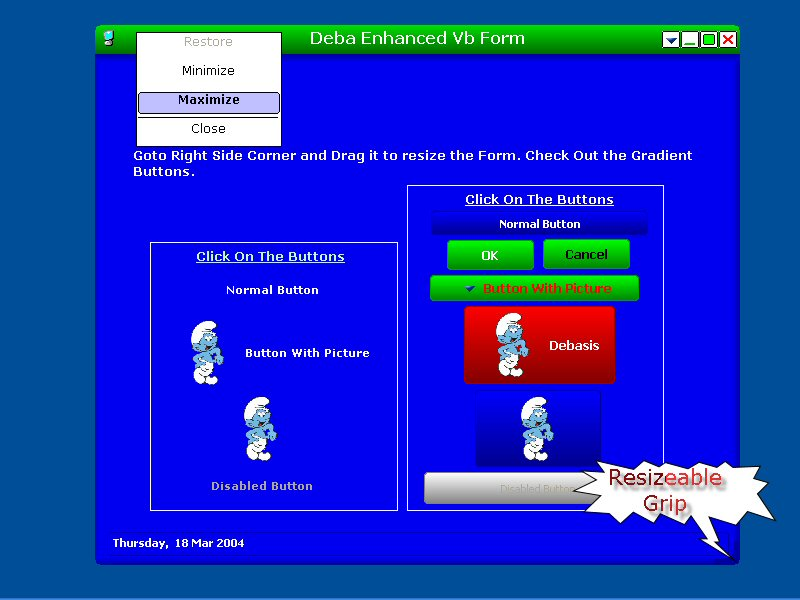



## Enhancing VB Form v 1\.1

### Description

Enhancing VB Form with a new look and Check out Gradient Buttons. This Program Describe How you customized the Form. Resize the Window From Right Side Corner. Please Check Out The Code. Hope You like it.
 
### More Info
 

             |
---                |---
**Submitted On**   |2004-03-12 17:42:18
**By**             |[Debghosh](https://github.com/Planet-Source-Code/PSCIndex/blob/master/ByAuthor/debghosh.md)
**Level**          |Advanced
**User Rating**    |5.0 (20 globes from 4 users)
**Compatibility**  |VB 6\.0
**Category**       |[Custom Controls/ Forms/  Menus](https://github.com/Planet-Source-Code/PSCIndex/blob/master/ByCategory/custom-controls-forms-menus__1-4.md)
**World**          |[Visual Basic](https://github.com/Planet-Source-Code/PSCIndex/blob/master/ByWorld/visual-basic.md)
**Archive File**   |[Enhancing\_1721283172004\.zip](https://github.com/Planet-Source-Code/debghosh-enhancing-vb-form-v-1-1__1-52324/archive/master.zip)

